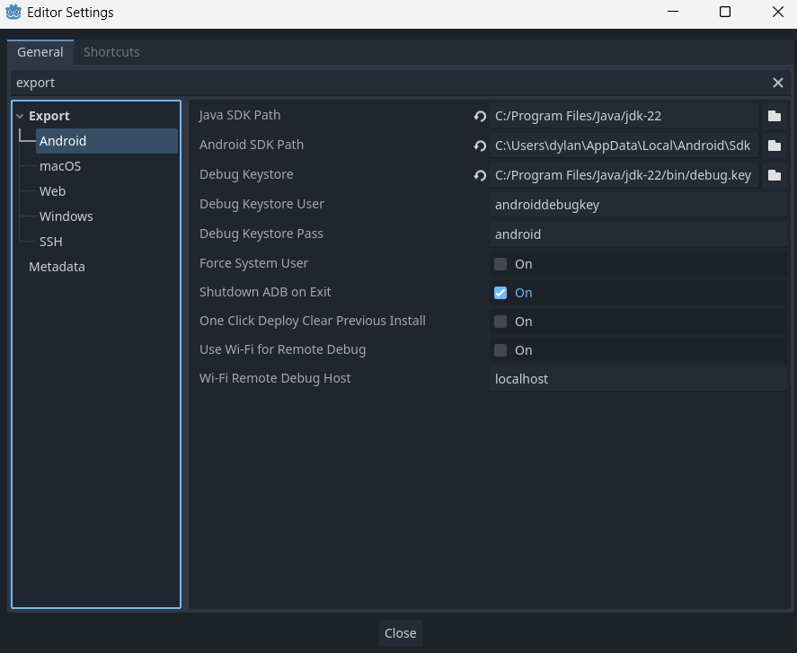
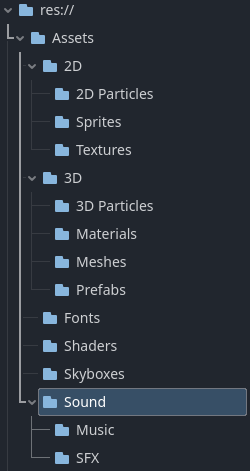
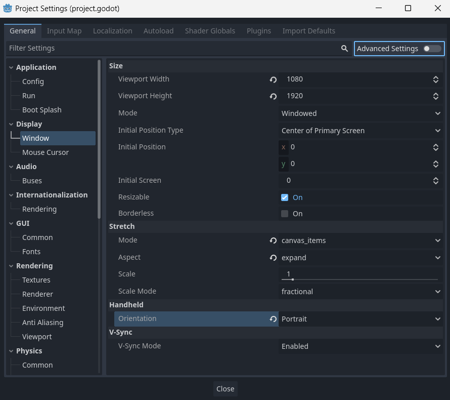
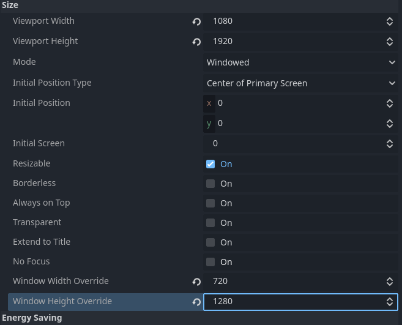
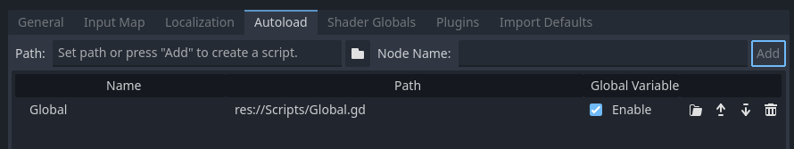
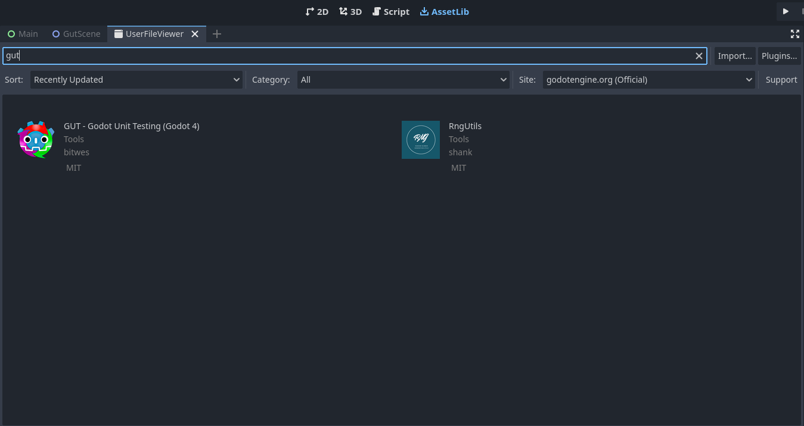

# Godot mobile UI template

> Source: Notion, *Projects → Documentation → Godot Mobile UI Template*
> (created 14 July 2024).

This is the documentation for the Pneumaturgy Godot UI Mobile Template. It
is used for quickly setting up projects for these purposes, and here I will
explain what this project holds and what you can expect.

For the from-scratch walkthrough, see
[Project set up](project-set-up.md).

## New machine?

If you're setting this up on a new machine, make sure you install the
necessary build materials. Video walkthrough:
[Export to Android](https://www.youtube.com/watch?v=dCLYMF32ZBE&t=1s)

1. **Set up Android Studio**
   - Download and install from
     [Android Studio](https://developer.android.com/studio).
   - Download JDK from
     [Oracle](https://www.oracle.com/java/technologies/downloads).
2. **Manage export templates**
   - `Editor / Manage Export Templates`
   - Download from the official GitHub releases mirror and install.
3. **Configure editor settings for Android export**
   - `Editor / Editor Settings / Export Android`
   - Navigate to **`%AppData%\Local\Android\Sdk`** and copy the path. Set
     the Android SDK path in editor settings.
   - Find the Java JDK in Program Files and paste as Java SDK path.

   

4. **Generate debug keystore**
   - Navigate to `C:\Program Files\Java\jdk-22\bin`, copy address
   - Open CMD as admin
   - `cd` to above address
   - and run:

     ```bash
     keytool -genkey -v -keystore debug.keystore -storepass android -alias androiddebugkey -keypass android -keyalg RSA -keysize 2048 -validity 10000 -dname "C=US, O=Android, CN=Android Debug"
     ```

   - Configure editor settings to use the debug keystore: navigate to path,
     jdk, bin, find keystore.
   - Use `androiddebugkey` for the user and `android` for the password.
5. **Final export settings**
   - Enable import for ETC2 and ASTC textures in project settings and
     restart.
   - Add Android export template and set package name according to Android
     conventions.
   - Export the project, enable "debug" mode, and upload the APK to your
     device.

## Change icon

1. Navigate to `Project / Project Settings / General / Application / Config / Icon`
2. Select a new image.

## Folder structure

> *The first thing you will notice as you open the example project is the
> folder structure. This is purely best practices because accessing files
> from the filepath can be a delicate process. Make sure you try to stick to
> the folder structure as much as possible.*

### Assets

1. 2D
   1. 2D Particles
   2. Sprites
   3. Textures
2. 3D
   1. 3D Particles
   2. Materials
   3. Meshes
   4. Prefabs
3. Fonts
4. Shaders
5. Skyboxes
6. Sound
   1. Music
   2. SFX



### Scenes

1. `Main.tscn`

> *This main scene serves to demostrate the default viewport settings in the
> UI for a mobile scene. Notice the vertical dimensions, and a control node
> that is anchored to full rect. See "Viewport set up" below.*

### Scripts

1. `Global`

> *This Global script is set up in the autoload settings. See "Autoload set
> up" below.*

### Tests

1. Unit

## Viewport set up

`Project / Project Settings / Display / Window`



1. Viewport Width: `1080`, Viewport Height: `1920`
2. Stretch mode: `canvas_items`
3. Handheld Orientation: `portrait`
   1. Optional: Window Width Override `1080 / 1.5`, Window Height Override
      `1920 / 1.5`
   2. Alternatively halve them again to get the desired size



## Autoload set up

1. Create a new script in the scripts folder
2. Call it `Global`
3. Navigate to `Project / Project Settings / Autoload`
4. Click `Path`, navigate to the Globals script. It will populate on the
   left side of the screen
5. Click `Add`



> Please note that the autoload contains example save / load functionality,
> as well as a "quit game" function that can be called from any script.

## [GUT — Godot Unit Tests](https://gut.readthedocs.io/en/latest/)

1. Navigate to `AssetLib`, search for `GUT`, click Download on
   `GUT - Godot Unit Testing`
2. Navigate to `Project / Project Settings / Plugins`
   1. Select `enable`



For purposes of this quick start guide, create a script file
`res://test/unit/test_example.gd` with the following content:

```gdscript
extends GutTest

func test_passes():
	# this test will pass because 1 does equal 1
	assert_eq(1, 1)

func test_fails():
	# this test will fail because those strings are not equal
	assert_eq('hello', 'goodbye')
```

### Run tests

> You may have to restart the engine to see all the settings.

- Open the GUT panel.
- Configure the directories where your tests are in the GUT Panel settings
  (you may need to scroll down to see this section). If you created the
  example test above, this would be in `res://test/unit`. A good strategy
  with GUT is to separate unit and integration tests into separate directory
  structures (such as `res://test/unit` and `res://test/integration`). Once
  you get a lot of tests, this will make it easier to run the fast unit
  tests frequently, and the slower integration tests only as often as is
  useful.
- Click "Run All" to run all your tests.
- Open a test script and click the button with your test script's name to
  run only that test script.
- Open a test script, put the cursor inside a test function, click the
  button with your test function's name to run just that one test.

Mouse over labels and buttons in the GUT panel for more information. You can
even set keyboard shortcuts for all of the GUT panel actions.

## Conclusion — export

1. Navigate to `Project / Export`
2. Add… `Android`
3. Navigate to `Package Name`
   1. Change Unique Name by removing everything including and after the `$`,
      and replacing with your game name
   2. Change Game Name

This project is now ready to be used. I recommend importing your initial
assets and trying to export. If you are not able to find the export window,
you may need to download export templates; see "New machine?" above.

## CI / CD

The `.github\workflows\ci.yaml` file is included to allow for CI/CD.

1. This is the GitHub Action that runs CI
2. On every `git push` event (any branch, including merges to `main`), this
   runs our GUT tests

Read more:

- [Continuous integration (AWS)](https://aws.amazon.com/devops/continuous-integration/)
- [GitHub Actions](https://github.com/features/actions)
