# Project set up

> Source: Notion, *Projects → Documentation → Project Set Up*
> (created 24 May 2024).
>
> ***Godot Crash Course: Creating a Simple Autochess Game***

For the reusable starting point, see
[Godot mobile UI template](godot-mobile-ui-template.md).

## Step 1 — project setup

### Starting from scratch

[Download Godot](https://godotengine.org/download/). Extract it somewhere
safe, not your desktop please!

Create a "GodotProjects" folder somewhere, like your documents, to store all
your future projects. Then, open up the Godot Project Manager by running the
program. Select `New Project`:

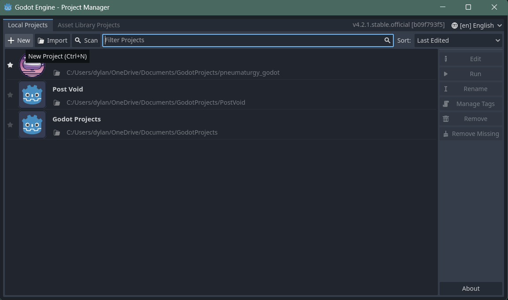

You will be prompted to enter a name. Ensure `Forward+` renderer is
selected, and the version control metadata is `Git`. Click `Browse` to
select a new project path.

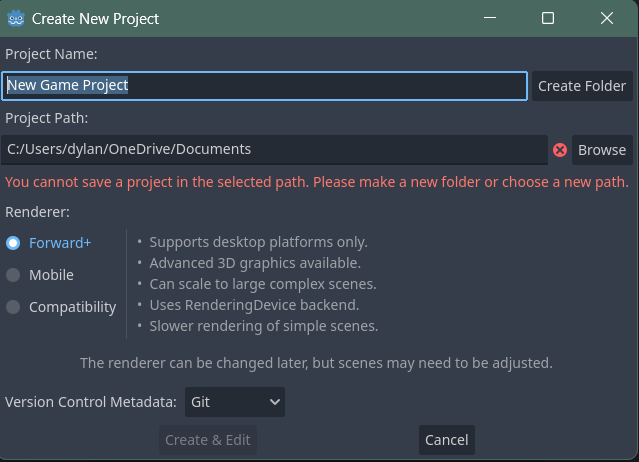

From the Documents directory, I have navigated to my "GodotProjects" folder,
and I will right click and create a new folder to save my project.

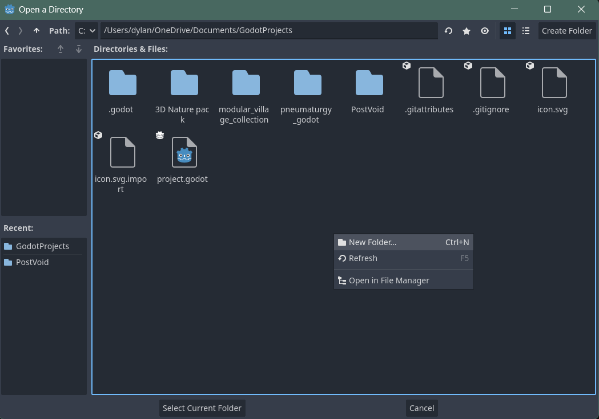

### From GitHub

[Download Godot](https://godotengine.org/download/). Extract it somewhere
safe, not your desktop please!

Create a "GodotProjects" folder somewhere, like your documents, to store all
your future projects. Clone a Godot repository to your local machine,
ideally in this new folder we made (I use GitHub Desktop, hate me if you
want, I don't care).

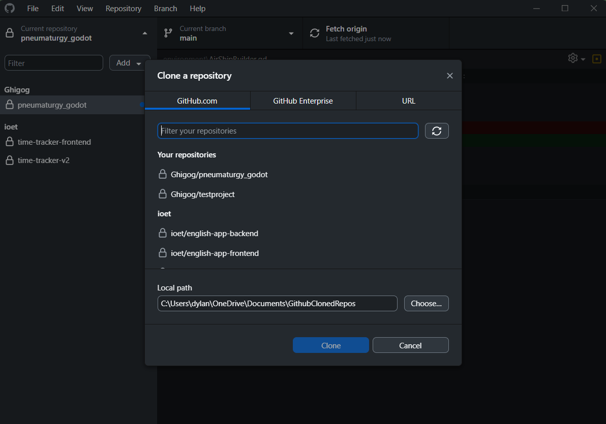

From Godot, select "Import", and find your cloned project.

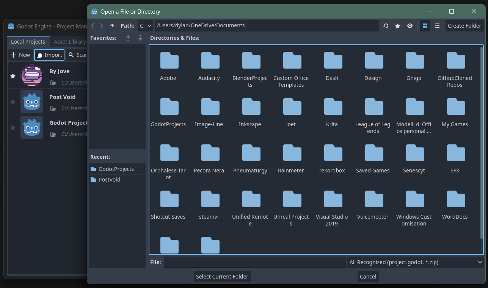

Optionally, create a `.gitignore`.

### Uploading a project

Create a new repository, using your favourite Git tool.

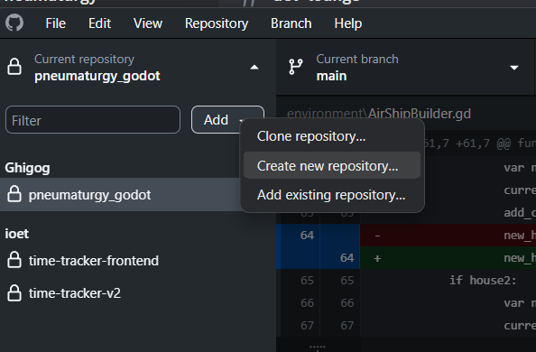

Enter the other settings as necessary, and create. Follow by publishing the
repo.

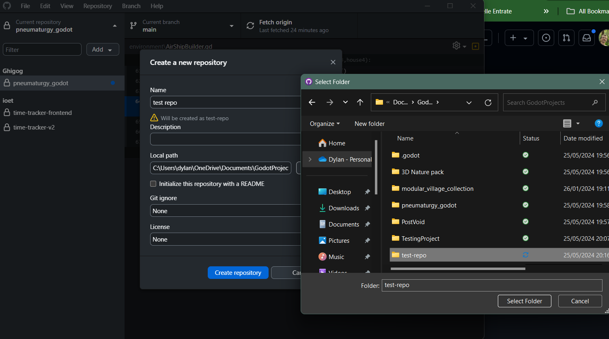

Back in Godot, create a new project, and browse to find the repo you just
created. Make sure you reach the final folder.

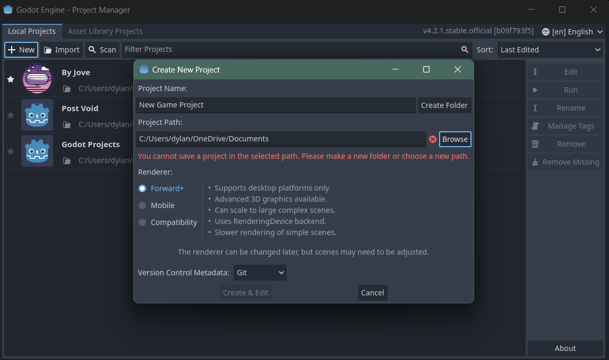

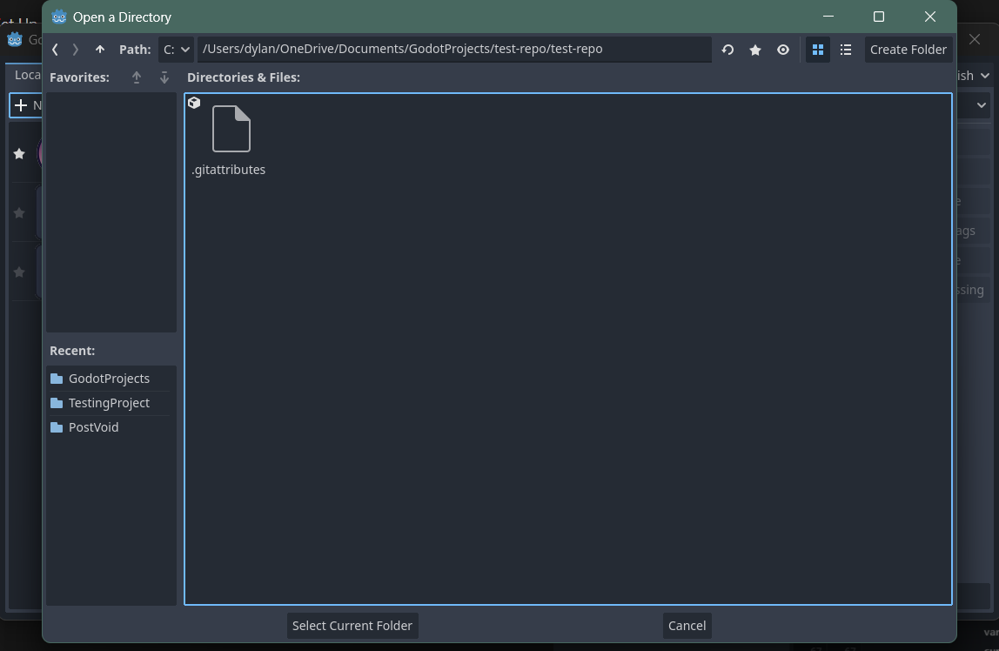

Start the project, and create some folders to test that you have
successfully connected your project. Upload your changes to main, or
alternatively a branch, to test if your changes are successfully saved on
the cloud.

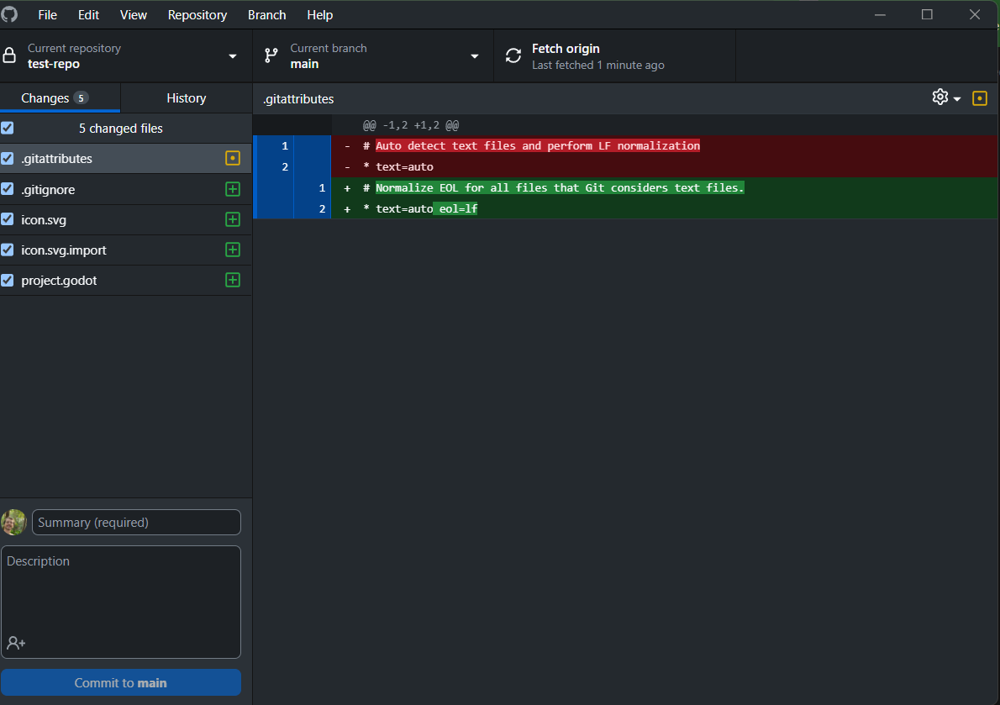

### Project structure

In the Godot FileSystem panel, create the following folders:

- **`Scenes`** — for all scene files.
- **`Scripts`** — for all GDScript files.
- **`Assets`** — for textures, sounds, and other assets.
- **`UI`** — for user interface elements.
- **`Resources`** — for any custom resource files.

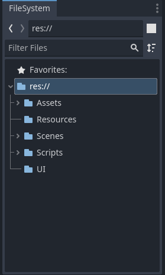

## Godot crash course

### Setup project

1. **Create UI scene**
   - Name it **`App`**.
   - Save it in the **`Scenes`** directory.
2. **Configure project settings for
   [mobile viewport](https://docs.godotengine.org/en/stable/tutorials/rendering/multiple_resolutions.html#mobile-game-in-portrait-mode)**
   - Set base window width to **`720`** and height to **`1280`**.
   - In advanced settings, set window override to ÷ 1.5.
   - Set **Display > Window > Handheld > Orientation** to **`portrait`**.
   - Set stretch mode to **`canvas_items`**.
   - Set stretch aspect to **`expand`**.
   - Configure Control nodes' anchors using the **Layout** menu.

### Create the main menu

1. **Build UI components**
   - Use a **`Control`** node as the root.
   - Add a **`CanvasLayer`**.
   - Create **`BoxContainer`** for layout (center alignment, vertical
     toggle).
   - Add a **`RichTextLabel`** and adjust container sizing.
   - Add **`Buttons`**.
2. **Duplicate and create other scenes**
3. **Create script**
   - Connect button signals.
   - Use
     [`get_tree()`](https://docs.godotengine.org/en/stable/tutorials/scripting/scene_tree.html)
     and
     [`change_scene_to_file()`](https://docs.godotengine.org/en/stable/tutorials/scripting/change_scenes_manually.html)
     to change scenes.

### Gameplay logic

1. **Create a new scene for dice roll**
   - Add two **`Label`** nodes for displaying numbers and one **`Button`**.
   - Another **`Label`** to display your accumulated score, and another
     **`Button`** to quit.
   - Link button to a new script for handling the press event.
2. **Implement dice roll logic**
   - Use a random number generator to get values between 1 and 6 for both
     player and CPU.
   - Display the results.
   - Compare results and update the score: +1 for win, −1 for loss.
   - If score reaches 5, transition to the victory scene.
   - If score reaches −5, transition to the failure scene.

### Create globals script

- Autoload Globals
- Store player score and results, update gameplay script
- End function changes to end screen, resets score and result
- Also holds quit function

### Save and load progress

1. **Implement save and load mechanism**
   - Project Settings → Application → Config: set `use custom user dir` and
     `custom user dir name`.
2. **Change application icon**

Implement saving logic:

- **`Save()`** creates a new dict with all player data (score)
- **`SaveGame()`** instantiates a save file in directory
- **`JSON.stringify`** the save dict
- Store the savegame as a line in the JSON

Implement loading logic:

- Check if the save directory exists with save file
- Read the file
- For the length of the JSON file:
  - store a new line of the JSON
  - parse the individual JSON line and check if it's successful
  - store the data in a new variable
  - set the new data to your existing variables (score)

### Build end screen

- Create new end scene
- Insert containers, richtext labels, and two buttons
- Button pressed sends to appropriate destination (quit, restart)
- Hardcode victory and failure text
- Choose what label shows based on global player result

## Export to Android

Video walkthrough:
[Export to Android](https://www.youtube.com/watch?v=dCLYMF32ZBE&t=1s)

1. **Set up Android Studio**
   - Download and install from
     [Android Studio](https://developer.android.com/studio).
   - Download JDK from
     [Oracle](https://www.oracle.com/java/technologies/downloads).
2. **Manage export templates**
   - Download from the official GitHub releases mirror and install.
3. **Configure editor settings for Android export**
   - Editor → Editor Settings → Export → Android
   - Navigate to **`%AppData%\Local\Android\Sdk`** and copy the path.
   - Set the Android SDK path in editor settings.
4. **Generate debug keystore**
   - Navigate to `C:\Program Files\Java\jdk-22\bin`, copy address
   - Open CMD as admin
   - `cd` to above address
   - and run:

     ```bash
     keytool -genkey -v -keystore debug.keystore -storepass android -alias androiddebugkey -keypass android -keyalg RSA -keysize 2048 -validity 10000 -dname "C=US, O=Android, CN=Android Debug"
     ```

   - Configure editor settings to use the debug keystore: navigate to path,
     jdk, bin, find keystore.
   - Use **`androiddebugkey`** for the user and **`android`** for the
     password.
5. **Final export settings**
   - Enable import for ETC2 and ASTC textures in project settings and
     restart.
   - Add Android export template and set package name according to Android
     conventions.
   - Export the project, enable "debug" mode, and upload the APK to your
     device.
