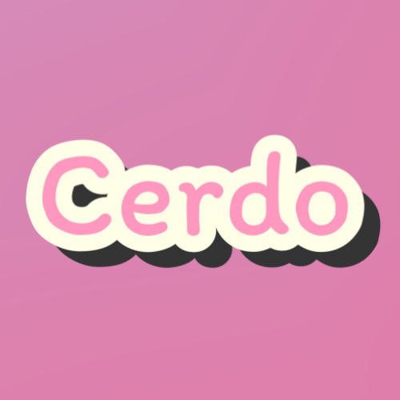
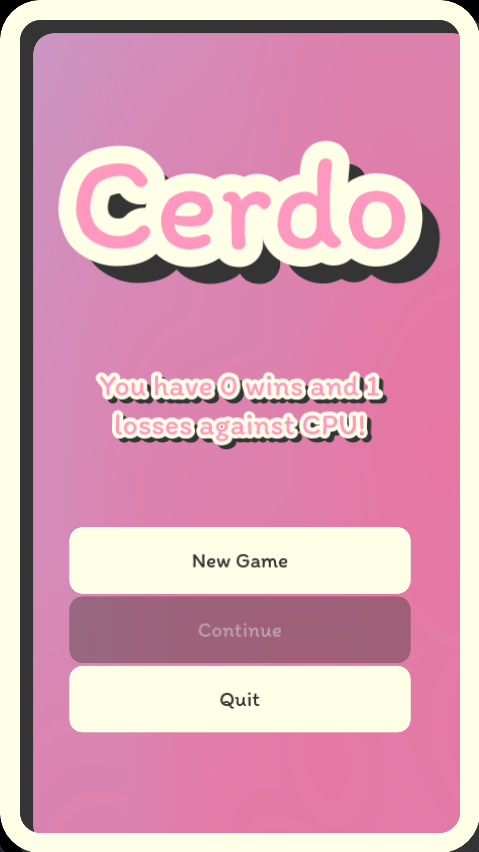
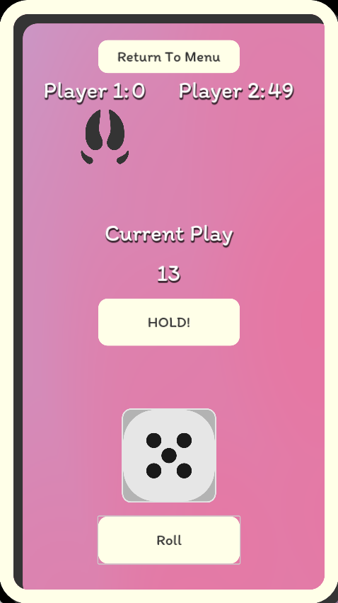

# Cerdo

> Status: shipped · prototype · closed 13 July 2024
> Source: Notion, *Projects → Closed Projects → Cerdo*.

**Cerdo: The Dice Rolling Challenge**

Welcome to Cerdo, a thrilling and fast-paced dice game perfect for friends!
In Cerdo, each player rolls a dice, accumulating points with each turn. But
beware — if you roll a one, you lose your accumulated dice score and must
pass the turn to the next player. The objective is simple: be the first to
reach 100 points!

## Features

- **Difficulty Options:** Choose from various difficulty levels to match
  your skill and preference. Whether you're a beginner or a dice-rolling
  pro, there's a challenge for everyone.
- **Combo Feature:** Get rewarded for certain dice rolls with our exciting
  combo feature. Keep an eye out for special roll combinations that can
  boost your score and give you an edge over your opponents.
- **Quick and Fun:** Cerdo is designed to be a short yet exhilarating game,
  making it the perfect choice for a fun-filled session with friends.

Developed as a prototype by Pneumaturgy game studio, Cerdo combines
strategy, luck, and a dash of risk, ensuring every game is unique and
entertaining. Roll the dice, aim for 100, and may the best player win!

