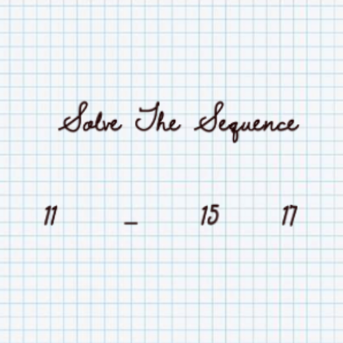
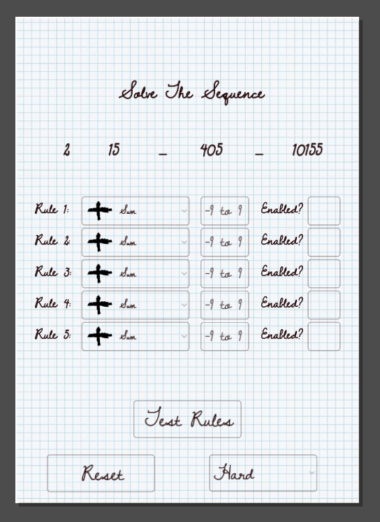
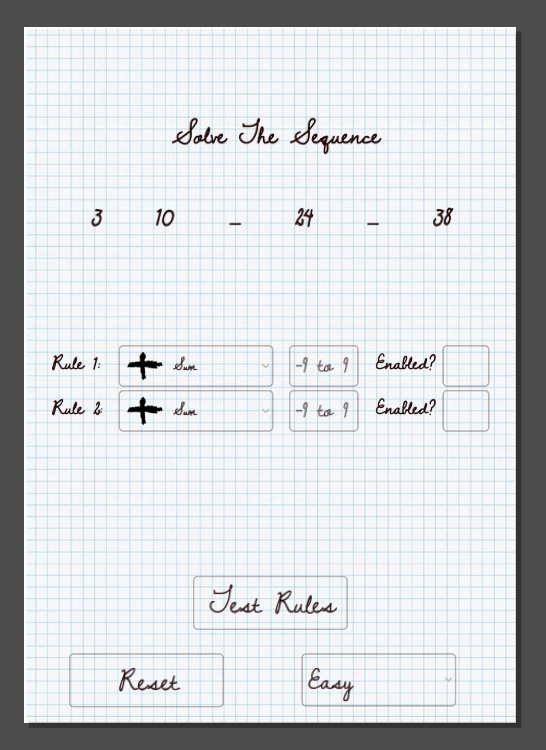

# PneuMath

> Status: shipped · game jam · built in ten hours · closed 13 July 2024
> Source: Notion, *Projects → Closed Projects → PneuMath*.

**Pneumath: The Elegant Number Puzzle**

Hey there! Welcome to Pneumath, a super quick and simple number puzzle game
that's all about figuring out hidden patterns. You'll get a sequence of
numbers with two missing, and your job is to figure out what math magic was
used to create the sequence. We whipped up Pneumath in just 10 hours for a
game jam! It's a labor of love from the Pneumaturgy team, and we're excited
to share it with you.

## Why you'll love it

- **Quick and Fun:** Perfect for a quick brain teaser. It's easy to pick up
  and play anytime you want a little challenge.
- **Elegant Design:** Clean, simple, and smooth. No distractions — just pure
  puzzle-solving goodness.
- **Choose Your Challenge:** Whether you're in the mood for something easy,
  medium, or hard, Pneumath has got you covered with different difficulty
  levels.

Give it a try, see if you can crack the code, and enjoy the elegant
challenge of Pneumath!

## Predecessor

`iHackN3WTON/gdt_GuessTheNumber` is understood to be an earlier version of
this idea rather than PneuMath itself. It is deliberately not linked from
the site.
